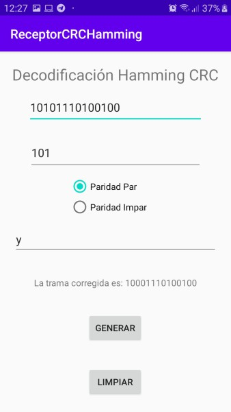
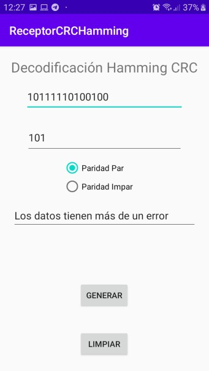
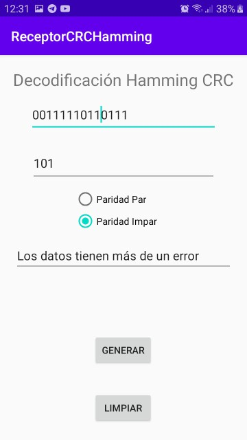

# ReceptorCRCHamming
This project simulates the process of the receiver of a byte of information into a network. It evaluates if the bit stream is correct. First it uses CRC, if the bit stream has problems, it tries to solve them by applying hamming code if it finds the mistake, shows the correct bit stream else it shows a message with "Data has more than one error".
 ## 1. Examples
 ### 1.   even parity (paridad par)

 ### 1. No mistake
    
 ### 2. One mistake
    
 ### 3. Two mistakes
    

 ### 2.   odd parity (paridad impar)
    ### 1. No mistake
    
    ### 2. One mistake
    
    ### 3. Two mistakes
    